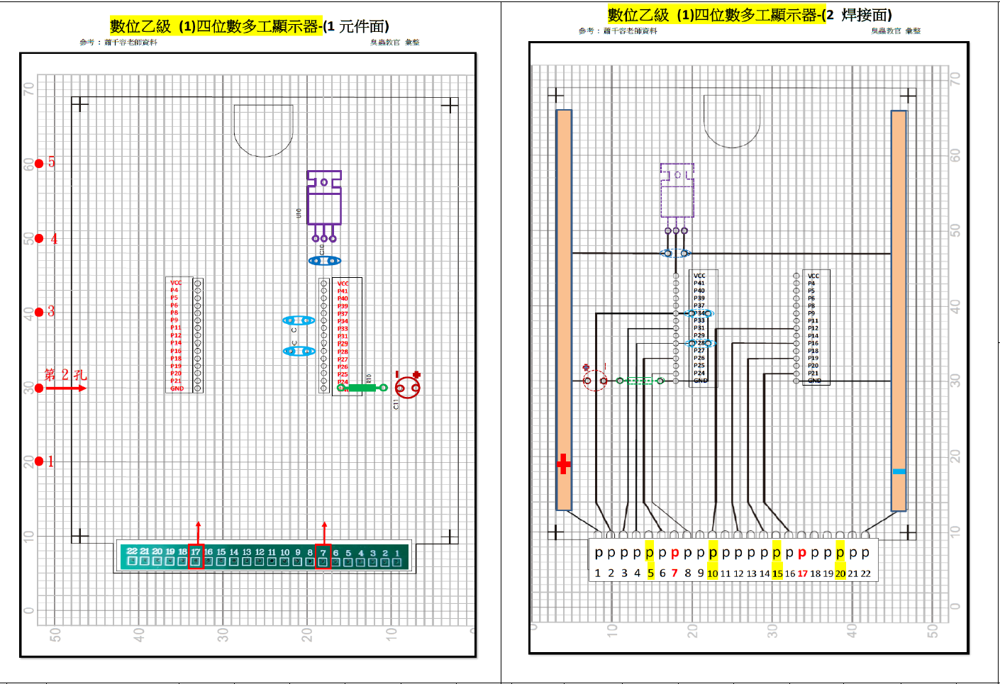
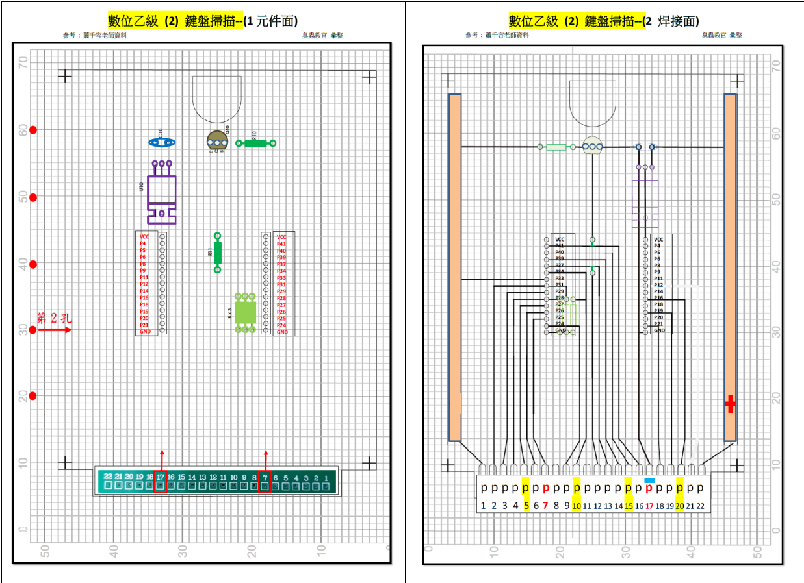

# 數位乙級檢定

> 僅供參考

## 第一題




```
set_location_assignment PIN_21 -to scan[1]
set_location_assignment PIN_19 -to scan[0]
set_location_assignment PIN_43 -to clk
set_location_assignment PIN_34 -to p2_CountSpeed
set_location_assignment PIN_31 -to p3_rst
set_location_assignment PIN_28 -to p4_ScanSpeed
set_location_assignment PIN_16 -to bcdcode[3]
set_location_assignment PIN_12 -to bcdcode[2]
set_location_assignment PIN_24 -to bcdcode[1]
set_location_assignment PIN_26 -to bcdcode[0]
```


## 第二題




```
set_location_assignment PIN_33 -to P1
set_location_assignment PIN_37 -to P13
set_location_assignment PIN_39 -to P14
set_location_assignment PIN_43 -to fin
set_location_assignment PIN_25 -to keycode[3]
set_location_assignment PIN_29 -to keycode[2]
set_location_assignment PIN_27 -to keycode[1]
set_location_assignment PIN_24 -to keycode[0]
set_location_assignment PIN_34 -to colum[2]
set_location_assignment PIN_28 -to colum[1]
set_location_assignment PIN_31 -to colum[0]
set_location_assignment PIN_40 -to scan[3]
set_location_assignment PIN_19 -to scan[2]
set_location_assignment PIN_41 -to scan[1]
set_location_assignment PIN_21 -to scan[0]
set_location_assignment PIN_26 -to pulse_o1
set_location_assignment PIN_16 -to pulse_o2
```


## 第三題


```
set_location_assignment PIN_27 -to P4
set_location_assignment PIN_26 -to P5
set_location_assignment PIN_25 -to P6
set_location_assignment PIN_24 -to P7
set_location_assignment PIN_28 -to P8
set_location_assignment PIN_19 -to P19
set_location_assignment PIN_18 -to P20_sel
set_location_assignment PIN_16 -to P21
set_location_assignment PIN_14 -to P22
set_location_assignment PIN_41 -to rst
set_location_assignment PIN_43 -to fin
set_location_assignment PIN_29 -to qa[1]
set_location_assignment PIN_31 -to qa[0]
set_location_assignment PIN_33 -to qb[3]
set_location_assignment PIN_34 -to qb[2]
set_location_assignment PIN_21 -to qb[1]
set_location_assignment PIN_20 -to qb[0]
```

