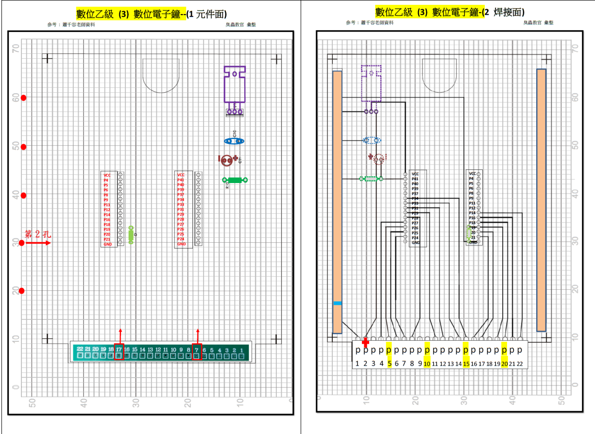
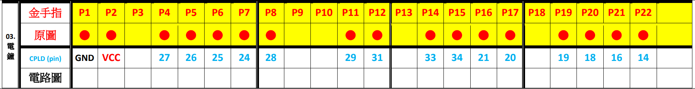

# 數位乙級檢定

> 僅供參考

## 第一題


```verilog
module vd1 (clk,p3_rst,p2_CountSpeed,p4_ScanSpeed,bcdcode,scan);
input clk;
input p3_rst,p2_CountSpeed,p4_ScanSpeed;
output reg[3:0]bcdcode;
output reg[1:0]scan;

reg [1:0]shiftflag;
reg ENB_CountSpeed,ENB_ScanSpeed;
reg[3:0] code1,code10,code100,code1000;
always@(posedge clk)begin

	ENB_CountSpeed <=  p2_CountSpeed;
	ENB_ScanSpeed <= p4_ScanSpeed;

end

always@(posedge ENB_ScanSpeed)begin
	case(shiftflag)
	2'b00:begin
		scan <= 2'b00;
		bcdcode<= code1000;
		shiftflag <= shiftflag+1'b1;
	end
	2'b01:begin 
		scan <= 2'b01;
		bcdcode<= code100;
		shiftflag <= shiftflag+1'b1;

	end
	2'b10:begin
		scan <= 2'b10;
		bcdcode<= code10;
		shiftflag <= shiftflag+1'b1;

	end
	2'b11:begin 
		scan <= 2'b11;
		bcdcode<= code1;
		shiftflag <= 2'b00;
	end
	endcase
end
always@(posedge ENB_CountSpeed,posedge p3_rst)begin
if(p3_rst)begin
	code1 <= 0;
	code10 <= 0;
	code100 <= 0;
	code1000 <= 0;
end 

else 
	begin
	if(code1>=9)begin
	code1 <= 0;
	code10 <= code10+1'b1;
	if(code10>=9)begin
		code10 <= 0;
		code100 <= code100+1'b1;
		if(code100>=9)begin
			code100 <= 0;
			code1000 <= code1000+1'b1;
			if(code1000>=9)
				code100 <= 0;
			end
		end
	end
	
else
	code1 <= code1+1'b1;
end
end
endmodule
```


## 第二題


```verilog
module vd2 (fin,enable,P13,P14,colum,scan,keycode,pulse_o1,pulse_o2,P1);
  input fin,enable,P13,P14;
  input[2:0] colum ;

  output[3:0] scan;
  output[3:0] keycode;
  output	pulse_o1, pulse_o2, P1;

  wire press_out;
  wire clk;
  reg [1:0] h2code;
  reg [3:0]keycode;
  reg [15:0] count;
  reg [3:0]scan;

  reg qa,qb,qc,qd;

  assign P1 = ~(P13 | P14);
  assign press_out = (colum[2] | colum[1] | colum[0]);
  assign clk = count[15];

  always@(posedge fin)count <= count + 1'b1;


  always@(posedge clk)
  begin
    if(colum == 3'b000)
    begin
      if(h2code>=3)
        h2code <= 0;
      else
        h2code <= h2code+1'b1;
    end
    else if(colum == 3'b001)		//scan colum_input (first)
      keycode <=  {2'b00 , h2code}; 	//output BCD CODE {00,+1~3}
    else if(colum == 3'b010)		//scan colum_input (second)
      keycode <=  {2'b01 , h2code};	//output BCD CODE {01,+1~3} = b'0100 = d'4 +1~3
    else if(colum == 3'b100)		//scan colum_input (third)
      keycode <=  {2'b10 , h2code};	//output BCD CODE {10,+1~3} = b'1000 = d'8 +1~3
  end

  always@(h2code)
  begin
    case(h2code)
      2'b00 :
        scan <= 4'b0001; //shifting scan row from 1 to 4
      2'b01 :
        scan <= 4'b0010;
      2'b10 :
        scan <= 4'b0100;
      2'b11 :
        scan <= 4'b1000;
    endcase
  end

  always @(posedge clk)
  begin

    qa <= press_out;
    qb <= qa;
    qc <= pulse_o1;
    qd <= qc;

  end
  assign pulse_o1 = qa& (~qb);

  assign pulse_o2 = qc& (~qd);
endmodule
```


## 第三題






```verilog
//3
module vl2 (rst, fin, P22,P20_sel,P5,P7,P19,P21,P8,P4,P6,qb,qa);
  input rst, fin, P22 ;
  input P20_sel,P5,P7,P19,P21;

  output reg  P8,P4,P6 ;
  output reg[3:0] qb;
  output reg[1:0] qa;


  reg[15:0] count ;
  reg clk, P20_sel_d, OneHz_in_d, P5_d, P7_d, P21_d, clk_h;
  always @(posedge fin)begin
    if (count >= 8000)
    begin
      count <= 0;
      clk <= clk^1;
    end
    else
      count <= count+1;
  end

  always @(posedge clk)begin
    P20_sel_d  <= P20_sel;//切換功能(調時or計時)
    OneHz_in_d <= P22;
    P21_d      <= P21;
    P7_d       <= P7;
    P5_d       <= P5;
  end
  always @(*)begin
    if(P20_sel_d == 1)begin
      clk_h <= P19;//input hour clock
      P8    <= P7_d;//tell Module update Min-Reg
      P4    <= OneHz_in_d;//p4 led toggle
      P6    <= P7_d; //bridge p7 for clear  Sec-Reg
    end
    else begin
      clk_h <= OneHz_in_d & P21_d;
      P8    <= OneHz_in_d & P5_d ;
      P4    <= 0; //p4 close led
      P6    <= 1;  //sending Module a sign to clear Sec-Reg
    end
  end
  always @(negedge clk_h,posedge rst )begin
    if(rst)begin
      qa <= 2'b0;
      qb <= 4'b0;
    end
    else begin
      if(qa>=2 && qb>=3)begin
        qa <= 2'b0;
        qb <= 4'b0;
      end
      else if(qb>=9)begin
        qa<=qa+1;
        qb<=4'b0;
      end
      else
        qb<=qb+1;
    end
  end

endmodule
```

