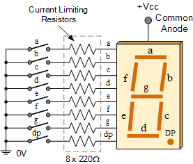
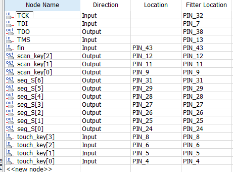

# 數位乙級檢定_新版

正在製作中


## 第二題

**7-segment Display** :




**4x3 Keypad Display:**


**Pin Assignment:**

```tex
set_location_assignment PIN_24 -to seg_S[0]
set_location_assignment PIN_25 -to seg_S[1]
set_location_assignment PIN_26 -to seg_S[2]
set_location_assignment PIN_27 -to seg_S[3]
set_location_assignment PIN_28 -to seg_S[4]
set_location_assignment PIN_29 -to seg_S[5]
set_location_assignment PIN_31 -to seg_S[6]
set_location_assignment PIN_43 -to fin
set_location_assignment PIN_9 -to scan_key[0]
set_location_assignment PIN_11 -to scan_key[1]
set_location_assignment PIN_12 -to scan_key[2]
set_location_assignment PIN_4 -to touch_key[0]
set_location_assignment PIN_5 -to touch_key[1]
set_location_assignment PIN_6 -to touch_key[2]
set_location_assignment PIN_8 -to touch_key[3]
```



